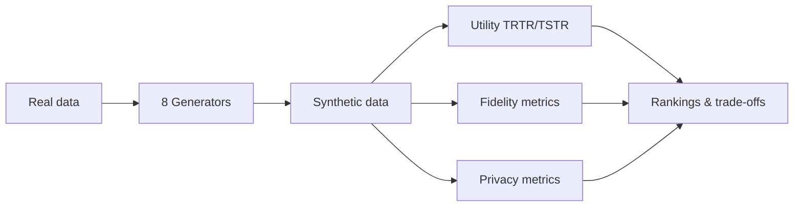
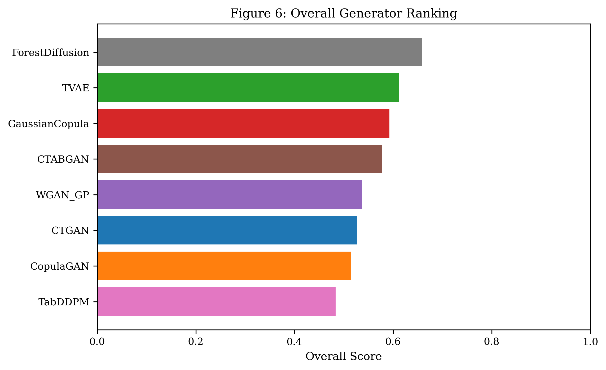

# SYNTH Benchmark

**A reproducible benchmark for tabular synthetic data** — comparing **8 generators** across **15 datasets** on **utility**, **fidelity**, and **privacy**, with publication-ready analysis and figures.

[](https://www.python.org/downloads/)
[](Materials/)
[](https://gopibattineni.github.io/SYNTH_BENCHMARK/)
[](#datasets)
[](#generators)

> **TL;DR** — Fit generators on real training data only → evaluate synthetic data with TRTR/TSTR utility, distributional fidelity, and privacy attacks → rank generators with statistical tests and Pareto trade-off analysis.

---

## Table of contents

- [Why this benchmark?](#why-this-benchmark)
- [Benchmark at a glance](#benchmark-at-a-glance)
- [Quick start](#quick-start)
- [Analysis pipelines](#analysis-pipelines)
- [Results & figures](#results--figures)
- [Repository layout](#repository-layout)
- [Experimental protocol](#experimental-protocol)
- [Datasets](#datasets)
- [Generators](#generators)
- [Dashboard](#dashboard)
- [Citation](#citation)
- [Changelog](#changelog)
- [Contributing](#contributing)

---

## Why this benchmark?

Synthetic tabular data is used for privacy-preserving sharing and ML augmentation — but **no single metric tells the full story**. SYNTH evaluates every generator on three complementary axes:

| Pillar | Question | Key metrics |
|--------|----------|-------------|
| **Utility** | Does synthetic data train useful models? | TRTR vs TSTR — Accuracy, F1, R², RMSE (10 seeds × 10 downstream models) |
| **Fidelity** | Does synthetic data look like the real distribution? | KS, JS, Wasserstein, MMD, SDV Quality Score, t-SNE |
| **Privacy** | Can an attacker infer training membership? | MIA AUC, Mahalanobis distance, NNDR, Hungarian matching |



---

## Benchmark at a glance

| | |
|---|---|
| **Datasets** | 15 UCI-style tabular datasets (9 classification + 6 regression) |
| **Generators** | CTGAN, CopulaGAN, TVAE, GaussianCopula, CTABGAN, WGAN-GP, TabDDPM, ForestDiffusion |
| **Seeds** | 10 random seeds (`42`–`51`) — reported as mean ± SD |
| **Leakage protocol** | Generators fit on **train only**; TSTR tested on held-out **real test** set |
| **Outputs** | Excel workbooks, paper-ready figures (300 DPI), LaTeX tables, statistical tests |

**Current overall ranking** (composite score: 40% utility / 30% fidelity / 30% privacy):

| Rank | Generator | Composite |
|------|-----------|-----------|
| 1 | ForestDiffusion | 0.66 |
| 2 | TVAE | 0.61 |
| 3 | GaussianCopula | 0.59 |

*See [`Results/Processed_Data/generator_ranking.csv`](Results/Processed_Data/generator_ranking.csv) for full rankings.*

---

## Quick start

### 1. Clone & install

```bash
git clone https://github.com/gopibattineni/SYNTH_BENCHMARK.git
cd SYNTH_BENCHMARK
pip install -r requirements-analysis.txt
```

### 2. Run the full analysis pipeline (~3 min)

Auto-discovers all Excel files, merges metrics, runs Friedman/Nemenyi tests, and generates **60+ publication figures**:

```bash
python run_analysis.py
```

Outputs land in [`Results/`](Results/).

### 3. Run the Cancer & Mushroom case study (~3 min)

Focused two-dataset assessment with 18 figures per dataset:

```bash
python run_two_datasets_assessment.py
```

Outputs land in [`Results/Two_Datasets_Assessment/`](Results/Two_Datasets_Assessment/).

### 4. Extract paper-ready workbooks (optional)

```bash
python scripts/extract_paper_results.py
```

Creates per-dataset `TRTR_TSTR_results_*.xlsx` and `fidelity_privacy_metrics.xlsx` under [`paper results/`](paper%20results/).

---

## Analysis pipelines

Two automated pipelines turn raw experiment Excel files into journal-ready outputs. **No filenames are hardcoded** — new results are picked up automatically on the next run.

### Full benchmark (`run_analysis.py`)

| Step | What it does |
|------|----------------|
| Merge | Discovers all `.xlsx` files under `Generators/` |
| Score | Normalized Utility / Fidelity / Privacy scores (0–1) per dataset × generator |
| Statistics | Friedman, Nemenyi, Wilcoxon, Cohen's d, Cliff's delta |
| Benchmarking | Pareto frontiers, composite rankings, CD diagrams, seed stability |
| Figures | 14 core paper figures + supplementary plots (PNG/PDF/SVG/EPS @ 300 DPI) |

```bash
python run_analysis.py --utility-weight 0.4 --privacy-weight 0.3 --fidelity-weight 0.3
```

### Two-dataset case study (`run_two_datasets_assessment.py`)

Dedicated module for **Wisconsin Breast Cancer** and **Secondary Mushroom** — side-by-side comparison, 18 figures each, cross-dataset bar charts.

```bash
python run_two_datasets_assessment.py
```

### Key modules

| Path | Purpose |
|------|---------|
| [`analysis/`](analysis/) | Core pipeline — data loading, scoring, statistics, figures |
| [`analysis/two_datasets/`](analysis/two_datasets/) | Cancer & Mushroom case study |
| [`scripts/extract_paper_results.py`](scripts/extract_paper_results.py) | Notebook → paper Excel workbooks |
| [`dashboard/`](dashboard/) | Static GitHub Pages dashboard builder |

---

## Results & figures

After running the pipelines:

```
Results/
├── Master_Data/              # Merged long-format CSV (utility, fidelity, privacy)
├── Processed_Data/           # Cumulative scores & generator rankings
├── Figures/
│   ├── Tradeoff/             # Figures 1–5, 14 — utility/fidelity/privacy trade-offs
│   ├── Statistical/          # Rankings, CD diagrams, correlations
│   ├── Utility/              # TRTR/TSTR, classifier heatmaps
│   ├── Fidelity/             # Quality scores, feature heatmaps
│   ├── Privacy/              # Mahalanobis, privacy distributions
│   ├── Leakage/              # Leakage sensitivity curves
│   └── Benchmark/            # Pareto, composite, seed stability
├── Tables/                   # CSV, XLSX, LaTeX (best=**bold**, 2nd=_underline_)
├── Supplementary/            # Statistical test outputs, correlations
└── Two_Datasets_Assessment/  # Cancer & Mushroom case study
    ├── Cancer/
    ├── Mushroom/
    └── Comparison/
```

**Preview a figure:**

<p align="center">
  
</p>

---

## Repository layout

```
SYNTH_BENCHMARK/
├── Generators/
│   ├── SDV models/                    # CTGAN, CopulaGAN, TVAE, GaussianCopula — full audit
│   ├── Other GANS/                    # CTABGAN, WGAN-GP — full audit
│   ├── Diffusion GANs/                # TabDDPM, ForestDiffusion — full audit
│   └── Experiment with utility data leak/
│       ├── utility results/           # TRTR/TSTR Excel (primary utility source)
│       └── diffusion_dataleak/        # Diffusion + SDV utility variant
├── analysis/                          # Automated publication pipeline
├── Results/                           # Generated analysis outputs
├── paper results/                     # Per-dataset paper workbooks
├── scripts/                           # Extraction & utility scripts
├── dashboard/                         # GitHub Pages dashboard
├── docs/                              # Built static site (GitHub Pages)
├── Datasets/                          # Cached dataset CSVs
├── Materials/                         # Paper notes & supplementary docs
└── figures/                           # Workflow diagram generators
```

---

## Experimental protocol

Every dataset notebook follows the same leak-safe design:

1. **Preprocess** — drop IDs, dates, session columns; handle missing values
2. **Subsample** to N = 1,000 rows (`seed = 42`)
3. **Split** — stratified 80% train / 20% test
4. **Generate** — each generator fits on `train_real` only → 1,000 synthetic rows
5. **Evaluate fidelity** — KS, JS, Wasserstein, MMD, SDV quality, t-SNE
6. **Evaluate utility** — 10 downstream models × 10 seeds; TRTR baseline vs TSTR
7. **Evaluate privacy** — MIA, Mahalanobis matching, nearest-neighbour distance
8. **Export** — Excel workbooks with mean ± SD and utility gaps

**TRTR** = Train on Real, Test on Real (baseline)  
**TSTR** = Train on Synthetic, Test on Real (utility of synthetic data)  
**Utility gap** = TRTR − TSTR (smaller = better synthetic utility)

---

## Datasets

| # | Name | Task | # | Name | Task |
|---|------|------|---|------|------|
| 1 | Wisconsin Breast Cancer | Classification | 9 | MAGIC Gamma Telescope | Classification |
| 2 | Alzheimer's | Classification | 10 | Metro Interstate Traffic | Regression |
| 3 | Adult Census | Classification | 11 | Online Shopping | Regression |
| 4 | Forest Cover | Classification | 12 | Air Quality | Regression |
| 5 | Bank Marketing | Classification | 13 | Concrete Strength | Regression |
| 6 | Wine Quality | Classification | 14 | Energy Efficiency | Regression |
| 7 | CDC Diabetes | Classification | 15 | Real Estate Valuation | Regression |
| 8 | Secondary Mushroom | Classification | | | |

Metadata: [`Generators/Experiment with utility data leak/python_scripts/hive/datasets.json`](Generators/Experiment%20with%20utility%20data%20leak/python_scripts/hive/datasets.json)

---

## Generators

| Generator | Family | Folder |
|-----------|--------|--------|
| CTGAN | GAN (SDV) | `SDV models/` |
| CopulaGAN | GAN (SDV) | `SDV models/` |
| TVAE | VAE (SDV) | `SDV models/` |
| GaussianCopula | Statistical (SDV) | `SDV models/` |
| CTABGAN | GAN | `Other GANS/` |
| WGAN-GP | GAN | `Other GANS/` |
| TabDDPM | Diffusion | `Diffusion GANs/` |
| ForestDiffusion | Diffusion | `Diffusion GANs/` |

### Extra setup for diffusion generators

```bash
git clone https://github.com/yandex-research/tab-ddpm _vendor/tab-ddpm
pip install ForestDiffusion xgboost category-encoders imbalanced-learn
pip install "libzero==0.0.8" "rtdl==0.0.13" --no-deps   # torch 2.x compatible
```

---

## Dashboard

Interactive results browser deployed via GitHub Pages:

**[https://gopibattineni.github.io/SYNTH_BENCHMARK/](https://gopibattineni.github.io/SYNTH_BENCHMARK/)**

Rebuild locally:

```bash
python run_analysis.py --dashboard
python dashboard/build_pages.py
# Static site in docs/
```

---

## Citation

If you use this benchmark in your research, please cite:

```bibtex
@misc{battineni2026synth,
  title  = {SYNTH Benchmark: A Reproducible Evaluation of Tabular Synthetic Data Generators},
  author = {Battineni, Gopi},
  year   = {2026},
  url    = {https://github.com/gopibattineni/SYNTH_BENCHMARK}
}
```

When reporting results, always state: dataset, generator, downstream model, **mean ± SD over 10 seeds**, TRTR baseline, TSTR score, and that generators were trained on training data only.

---

## Changelog

See [**CHANGELOG.md**](CHANGELOG.md) for release history and recent updates.

---

## Contributing

Contributions are welcome! See [**CONTRIBUTING.md**](CONTRIBUTING.md) for guidelines on running pipelines, adding datasets, and submitting pull requests.

---

<p align="center">
  <sub>Associated with LERO / BDS research on synthetic data auditing · Built for reproducible, publication-ready benchmarking</sub>
</p>
